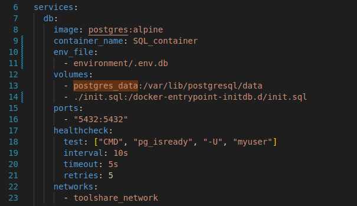

# :four: Milestone 4

## :screwdriver: ToolShare :screwdriver: 
**Version 1.4**

---

## Containerization

### 1. Container Cluster Structure Documentation

#### 1.1 Overview

To ensure both scalability and isolation, the web application is divided into three separate Docker containers. These are defined and launched using a `docker-compose` file:

1. **Web Application Container:** Hosts the FastAPI application.
2. **Database Container:** Runs a PostgreSQL database.
3. **Test Container:** Used for running automated tests without interfering with the main database.

#### 1.2 Custom Network

As a first step, a custom network is defined so that all containers can communicate with each other:

```bash
    networks:
        toolshare_network:
```

#### 1.3 Database Container



- **Base Image:** Uses the official lightweight `postgres:alpine`.
- **Environment Variables:** PostgreSQL credentials are set via environment variables, automatically creating the database at startup.
- **Volumes:** 
  - `postgres_data` persists database data across container restarts and maps to `/var/lib/postgresql/data`.
  - `./init.sql` initializes the test database state.
- **Ports:** The default PostgreSQL port is used.
- **Health Checks:** Ensures the database is ready before dependent containers start.

#### 1.4 Web Application Container


- **Dockerfile Based:** Built using the provided Dockerfile.
- **Environment Variables:** Includes `DATABASE_URL` and `SECRET_KEY`.
- **Port Mapping:** Exposes port `8000` (FastAPI default), restricted to localhost.
- **Dependencies:** Waits for the database container’s health check.
- **Logging:** Writes logs to a file and to the container’s stdout for easier debugging.

#### 1.5 Test Container


- **Purpose:** Runs `pytest` for automated testing.
- **Isolated Database:** Uses its own separate database to prevent interference with the main database.
- **Configuration:** Similar to the Web Application Container, but dedicated to testing.

### 2. Dockerfile


- **Base Image:** Starts from a lightweight Python 3.10 image.
- **Working Directory:** Creates and sets `/app` as the working directory.
- **Dependencies:** Copies `requirements.txt` and installs the necessary packages.
- **Application Files:** `COPY . .` brings all application files into the container.
- **Port Exposure:** `EXPOSE 8000` makes port 8000 available.
- **CMD:** Specifies the default command (e.g., `uvicorn`) to start the FastAPI application.
