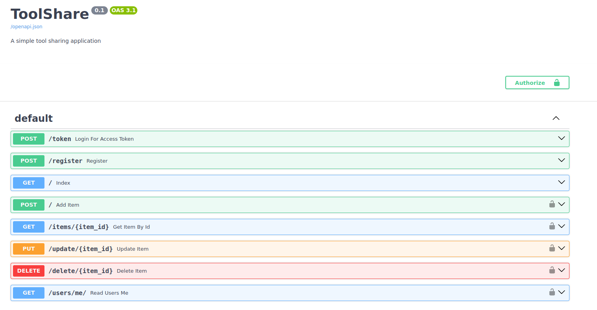
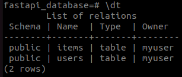
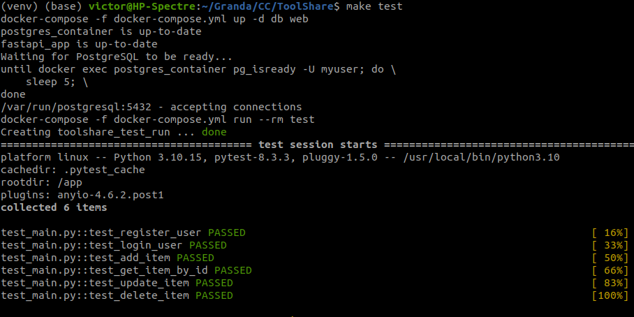
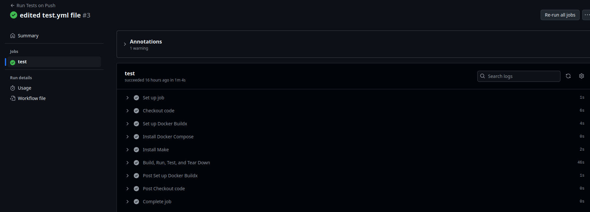
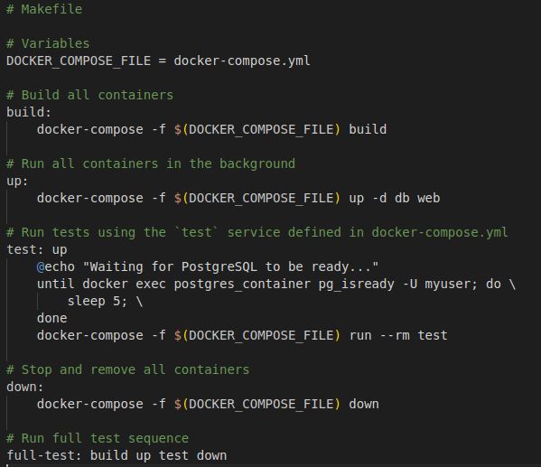

# :two: Milestone 2

## ToolShare (current state)

New Users can now sign up at ToolShare and Login. After the User has registered and loged in one can add, update and deleted items from the system. The items are saved in a database. To guarantee isolation and universal deployment the application and databases run in Docker containers. For simplicity and CI, a Makefile and test cases are implmented. GitHub Actions are used to automate testing every time something is pushed to the reposititory. 

## Setting up the Framework

### Web Framework
I chose FASTAPI as the web framework for this project. FastAPI is a modern, fast (high-performance), web framework for building APIs with Python based on standard Python type hints. It is a good choice for this project because it is easy to use and is written in python which is the language that I am using for this project.

### Database 

Without using a Database, changes in the items register are lost every time the system is shut down. For this reason i chose to use PostgreSQL. In the Database a table of users and of items is created. I picked PostgreSQL for the database because it’s reliable and handles complex data well. It pairs well with FastAPI, especially since they both support async calls, so data can be accessed quickly without slowing things down.

### Docker Containers 
When it comes to Docker, I chose it because of its flexibility and consistency. Docker lets me package the FastAPI application, PostgreSQL database, and testing environment into separate, isolated containers. This is incredibly useful for development and deployment. Containers allow each service to run with its own dependencies and environment, ensuring that what works locally will work the same in any environment where the containers are deployed. It also simplifies scaling the application since new containers can be added or removed with ease. With Docker, I can make sure each service is running in its own environment, yet they can communicate efficiently, almost as if they were parts of a single machine.

For now I have tree contrainer:  
**postgres_container** for the databases  
**fast_api** for the FASTAPI application  
**toolshare_test_run** for testing  

### Testing

For testing, I chose pytest since it’s straightforward and effective. It keeps tests readable and has tons of plugins for extended functionality. Running it in a separate container and using a seperate test database makes sure tests don’t interfere with the main app, so I can test in a clean, controlled environment every time.

### Automated Testing with GitHub Action

With GitHub Actions, I can set up continuous integration (CI) so that every time I push code, the app runs through all my tests in a clean environment.  It’s a great complement to Docker, pytest, and the Makefile, creating a smooth, reliable pipeline that saves time and keeps everything running consistently.

### Makefile

Finally, the Makefile pulls it all together. Instead of typing a bunch of commands, I just use a single command in the Makefile to start everything up or run tests. It’s like a shortcut to run everything smoothly and makes sure all the pieces work together without a hitch.

