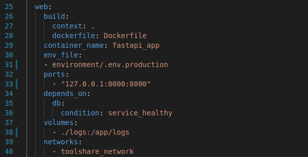
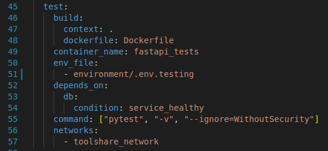
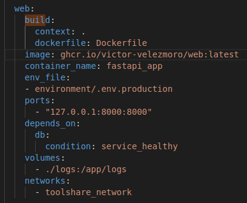

# 🎯 Milestone 4

## 🔧 ToolShare  
**Version 1.4**

---

## 🚀 Containerization

### 1. **Container Cluster Structure Documentation**

---

### 1.1 **Overview**

To ensure **scalability** and **isolation**, the web application runs in **three separate Docker containers**, defined and launched using a **`docker-compose`** file:  
1. **Web Application Container**  
2. **Database Container**  
3. **Test Container**

---

### 1.2 **Custom Network**

As a first step, a **custom network** is defined to allow communication between all containers:

```yaml
networks:
    toolshare_network:
```

### 1.2 **Database Container**


In the first container I stored the database, more precisely I used the PostgreSQL Database. Therefore I used the official lightweight `postgres:alpine` image. As a next required step is to import the environment, which defines the PostgresSQL credentials. In this step a database is automatically created. Further I mounted two valumes: `postgres_data` is used to avoid data loss between container restarts and Maps to `/var/lib/postgresql/data` inside the container. `./init.sql` is a SQL file that is executed at startup and builds the initial test database state. For ports I used the default ports of PostgreSQL. Health check are used to verify if the database is ready. 

## 1.3 Web-application-Container



This container is used to run the web application and is build on the Dockerfile. I import the environment which provides the DATABASE_URL and the SECRET_KEY. For port mapping from the host port inside the contianer I used the default 8000 from FastAPI, but restict the use to localhost only. To guarantee functionality this container depends on the health of the DB-Container. To make debugging easier and to allow monitoring we log the system and write it in a log file and inside the container. 

## 1.4 Test-Container



This container works similar to the Web Service Container but uses a seperate database to not interfere with the original database and runs the `pytest` tests.


## 1.5 Dockerfile 


The Web Service and the Testing Services build their containers based on this Dockerfile. Therefore they use a lightweight Python image with Python 3.10. Next a working directroy inside the container is set up called `/app`. Next the requirement filed is coppied into the container and is executed. The requirement.txt file list all necessary packages that are needed to run the system. `COPY . .` coppies all other application from the host into the container. `EXPOSE 8000` tells Docker to expose port 8000 for the container. This is the port FastAPI will listen on when the container runs. `CMD`specifies default commands when the container is launched. 


### 2. **Implemanting GitHub Packages**

As a next step i implemented GitHub Packages to store the Docker images. The idea behind this is to have a central place to store the images and to not have to build the images on the local machine. This safes time and resources.

## 2.1 **GitHub Actions**


GitHub Actions are used to build the Docker images and to push them to the GitHub Packages. The first step is to login to the GitHub Packages. Next the Docker images are build and tagged with the GitHub Packages URL. The last step is to push the images to the GitHub Packages. 
Before we can login we have to create a GitHub Secret. This is done in the settings of the repository. 


First we need to create a personal access token. This is done in the settings (Developer Settings) of the GitHub account. Next we navigate in the repository settings to the secrets and create a new secret. The secret is called DOCKER_TOKEN2. We can see the secret in the GitHub Actions to login to the GitHub Packages.


## 2.2 **Docker Compose**

We need to update our Docker Compose file to use the images from the GitHub Packages. This is done by changing the image URL to the GitHub Packages URL. 




We now no longer need to build the images on the local machine. We can just pull the images from the GitHub Packages.


